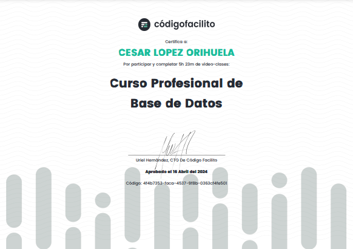

  

<h1 align="center" id="db">Base de Datos SQL con MySQL</h1>

Repositorio que contiene proyectos y ejercicios relacionados con bases de datos SQL utilizando MySQL. Este espacio tiene como finalidad mostrar mis avances y habilidades adquiridas durante las certificaciones y cursos.

---

## Insignias

<section align="center">

</section>

---

## Herramientas y Programas Utilizados

1. **MySQL Workbench**: [Descargar](https://dev.mysql.com/downloads/workbench/)
2. **Entornos de Desarrollo Integrado (IDE)**:
   - **Visual Studio Code (VSC)**: [Descargar](https://code.visualstudio.com/)
3. **Línea de Comandos (CMD)**: [Más información](https://learn.microsoft.com/es-es/windows-server/administration/windows-commands/cmd)

---

## Proyectos y Ejercicios

Este repositorio está organizado en las siguientes carpetas según la plataforma de aprendizaje:

1. **[Alura](alura)**: Ejercicios y proyectos realizados durante los cursos de Alura.
2. **[CodigoFacilito](codigofacilito)**: Prácticas y proyectos del curso profesional de bases de datos.
3. **[TodoCode](todocode)**: Ejercicios adicionales y proyectos personales.
4. **[YouTube](youtube)**: Proyectos basados en tutoriales y cursos gratuitos.
5. **[Udemy](udemy)**: Ejercicios y proyectos realizados durante los cursos de Udemy.

- 5.1 **[SQL Total](<udemy/SQL Total>)**

---

## Estatus del Proyecto

<h4 align="center">

</h4>

---

## Acceso al Repositorio

<section align="center">

</section>

---

## Tecnologías Utilizadas

<section align="center">

</section>

---

## Certificados

<section align="center">

[ Curso Profesional de Base de Datos](https://codigofacilito.com/certificates/4f4b7353-faca-4537-9f8b-0363cf4fe501)

</section>

---

## Desarrollador

<section align="center">

[ Cesar Lopez Orihuela](https://github.com/Chinicuil87)

</section>

---

## Redes Sociales y Contacto

<section align="center">

</section>

---

  

