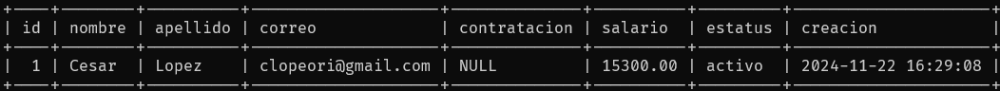
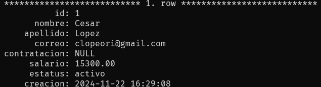
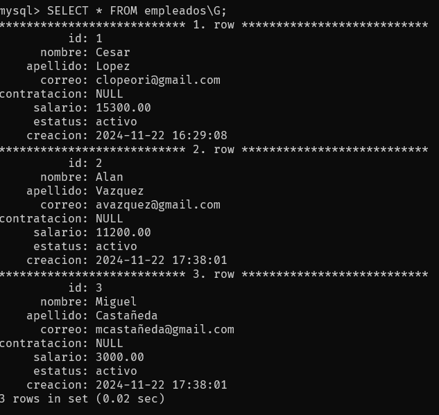
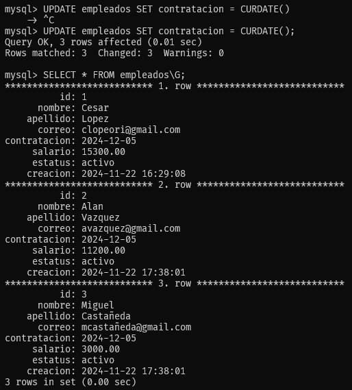
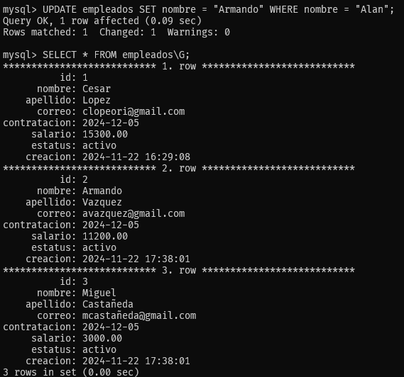
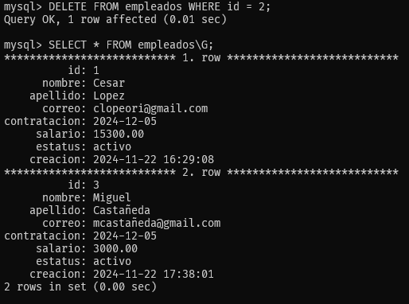

# SQL Básico - Bootcamp de Ingeniería de Datos

Comandos y ejecicios Clase Completa - SQL Básico

## Tipo de datos

> VARCHAR -> String (caracteres)  
> INTEGER -> int (enteros)  
> DECIMAL -> float (numeros decimales)
> DATE -> date(fecha)  
> DATETIME -> timestamp(fecha larga)
> BOOLEAN -> bool (verdadero o falso)
> ENUMS -> lista de tipos
> JSON -> formato JSON

### Conectarce a Base de Datos

> Base de datos local

- mysql -u "usuario" -p "contraseña"

> Base de datos local pero en diferente puerto

- mysql -u "usuario" -P "puerto" -p "contraseña"

> Base de Datos externa

- mysql -u "usuario" -p "contraseña" -h "ip"

## Comandos SQL

> Ver las Bases de Datos Existentes

- SHOW DATABASES;

> Crear una Base de Datos

- CREATE DATABASES "nombre de la Base de Datos";

> Usar una base de datos.

- USE "Nombre de la bade DB"

> Ver tablas existentes de en la base de datos.

- SHOW TABLES;

> Crear una tabla.

    * CREATE TABLE "nombre de la tabla"(campos);

    * campo

        - "nombre" "tipo de dato" "constraint"

        > Constraint -> Reglas para la columna.

> Ver la carecteristicas de la tabla

- DESC "nombre de la tabla";

### Ejercicio

[Tabla empleados](empleado.sql)

## CRUD (Crear, Leer, Actualizar y Eliminar)

### Crear registros

-INSERT INTO "nombre de la tabla"(campos) VALUES(valores);

> Insertar varios registros.

-INSERT INTO "nombre de la tabla"(campos) VALUES  
(valores),  
(valores);

### Leer registros

> Ver registros de una tabla.

- SELECT "campo" FROM "nombre de la tabla";

- SELECT "campo" FROM "nombre de la tabla"\G;

### Actualizar registros

- UPDATE "tabla" SET "campo" = "valor";

> Antes de la actulizacion.

> Despues de la actualizacion.

> Actulizar campo que cumplan una condicion.

- UPDATE "tabla" SET "campo" = "valor" WHERE "campo" = "condicion";

### Eliminar registros

> Todos los registros.

- DELETE FROM "tabla";

> NOTA: Eliminara todos los registros de la tabla si no sse hace uso de la condicion Where

> Eliminar los registros que cumplen con la condicion.

- DELETE FROM "tabla" WHERE "condicion";

### Reiniciar tabla.

TRUNCATE "tabla";

### Eliminar tabla.

DROP TABLE "tabla";
