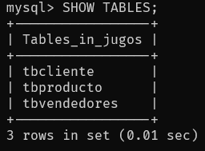

## SHOW DATABASES;

Muestra las Bases de Datos

## USE nombre_db;

Selecciona la Base de Datos que se utilizara

## SHOW TABLES;

Muestra las tablas que existen en la Base de Datos

## SHOW COLUMNS FROM tabla;

Muestra los campos de la tabla

## SELECT \* FROM tabla;

Muestra todos los registros de la tabla

